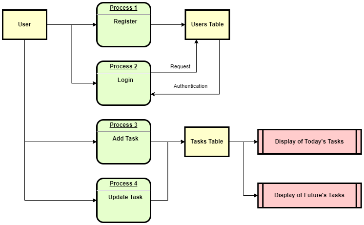
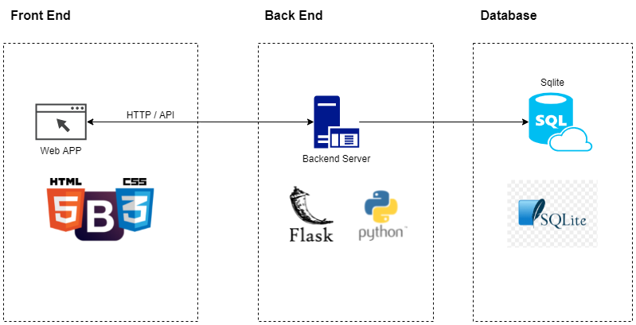
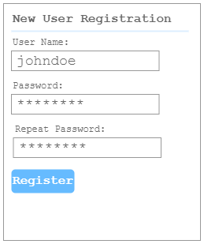
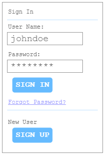
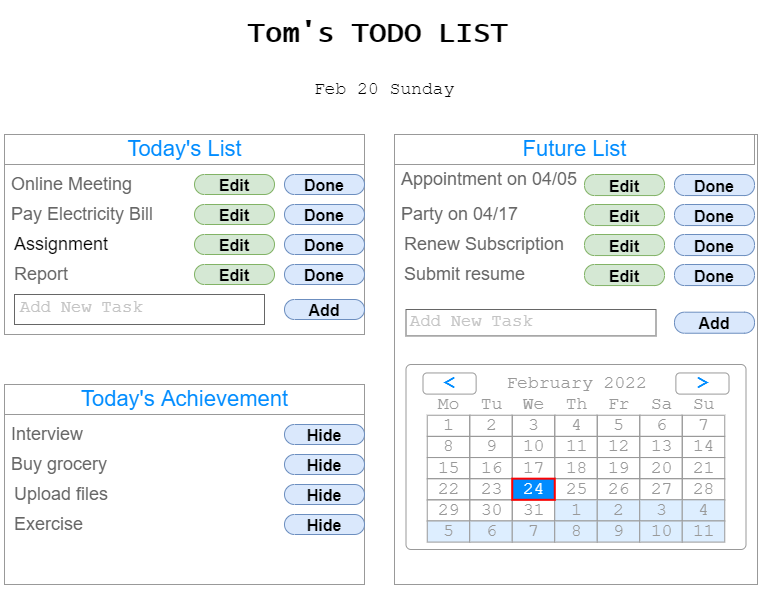
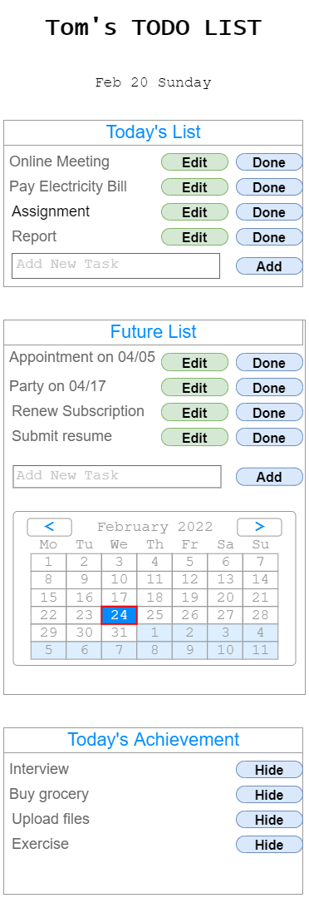
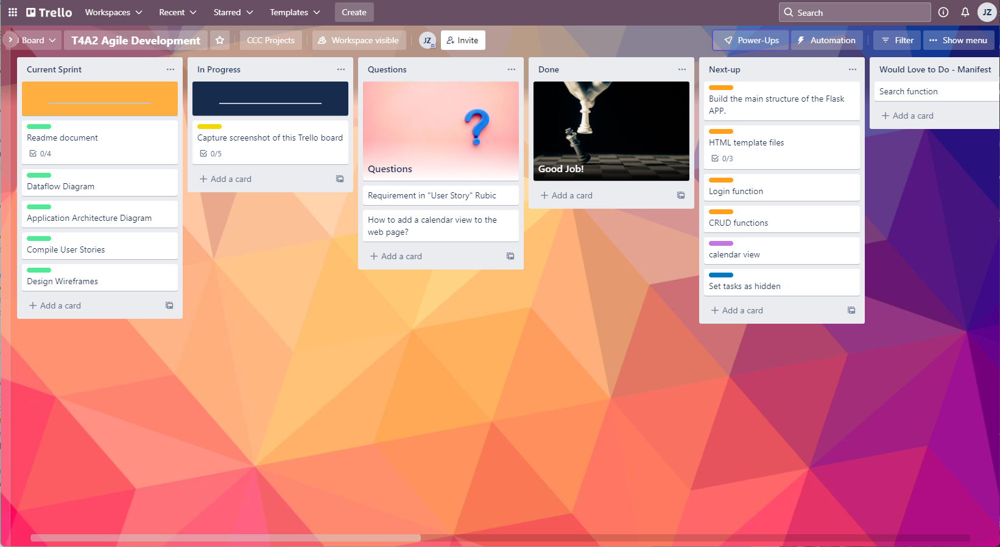
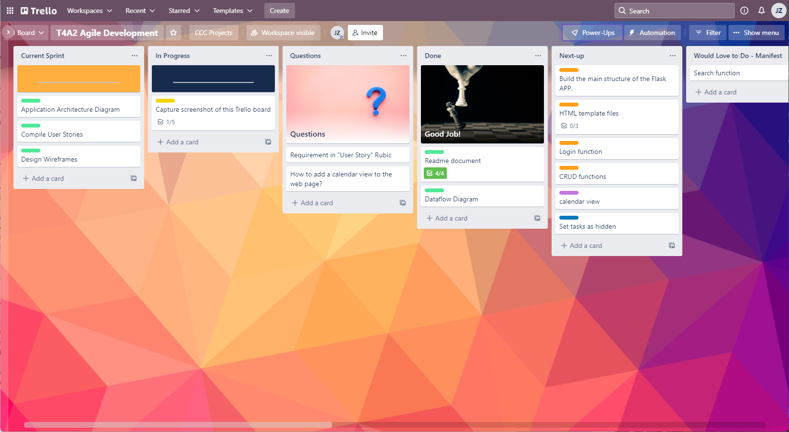
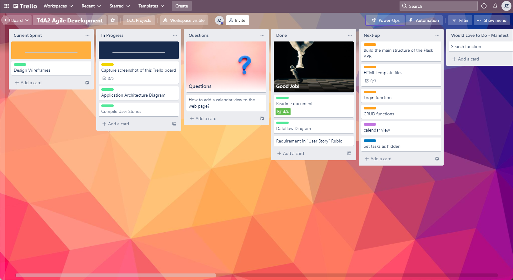
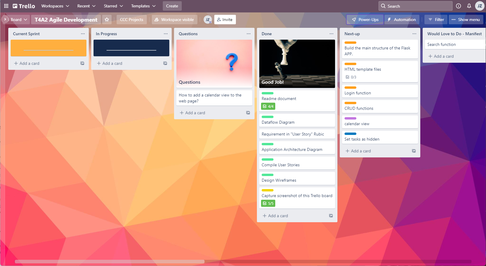

# Assignment T4A2: ToDo List Web App

## Description

### Purpose

This is a website for users to login and check on a daily basis. Users can record their things to be finished and get reminded when deadling comes.

### Features

Users can add items to Today's List or Future's List.

Tasks in the Future's List optionally has a due date.

Today's List will be automatically updated based on the due date.

Finished tasks will be moved to Finished List.

### Target Audience

Individual users who needs to record their daily tasks.

### Tech Stack

- Python / Flask
- HTML / CSS 
- SQLite
- AWS

## Dataflow Diagram

## Application Architecture Diagram

## User Stories

As a person living in mordern sociaty, everyone has many things to do and to remember. I want to have a app to remind me what I need to do within today, to show me what I achieved today, and what are the tasks for future.

When adding a new task, by default it is due today, and it will be saved in "today's list". If I specify a due date which is not today, the task will be saved in "future list".

When date changes, today's list will be updated automatically, those tasks in future list but due date is today will be moved to today's list.

I can mark the task as done, in that case the taks will be moved to today's achievement.

Above are the core functions of this web app. Below are the extensive function that will be added after the implementation of core functions

Quite often a task is a very small one and I do not want it to be shown in the list of achievement, in that case I can hide the task.

I can still search all the tasks in the database, including those hidden tasks.

I can search all the tasks by due date, content, tag or category.

## Wireframes

- Registration page for both desktop and mobile browsers:

- Sign-in page for both desktop and mobile browsers:

- List page for desktop view:

- List page for mobile view:

## Screenshot of Trello Board

