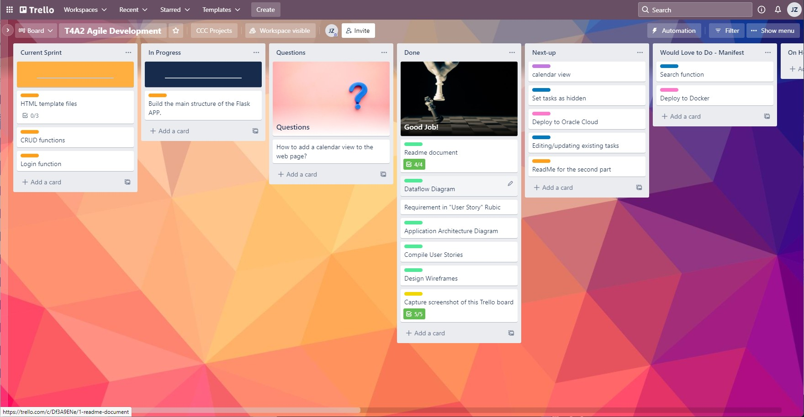
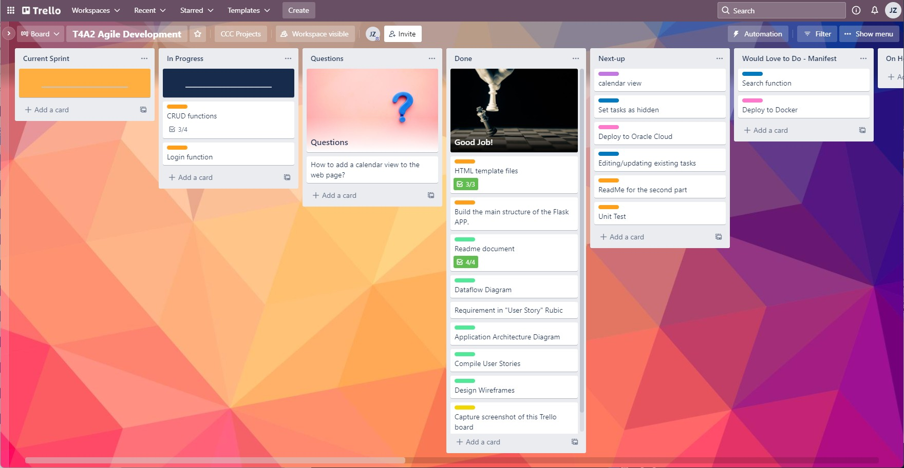
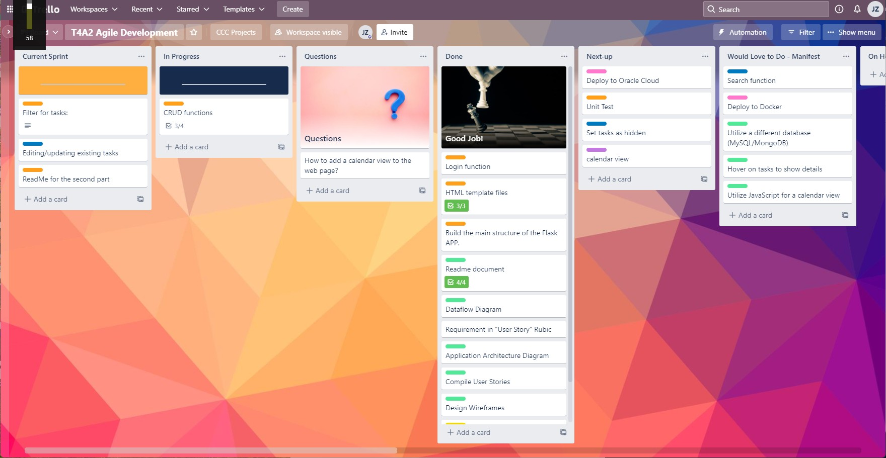
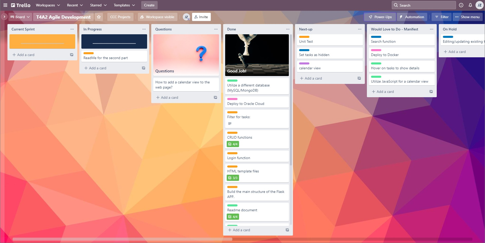

# Assignment T4A2: ToDo List Web App

## Deployment

This project is deployed on Oracle cloud. The links is: http://todo.junzeng.site or http://152.67.111.122/

## Github Link

https://github.com/Jazz0006/mytodolist

## Libraries Used:

- email-validator  
    Validate email address for form imput

- Flask  
    The framework for Python web application

- Flask-Login  
    The Flask plug-in for user management functions

- Flask-Migrate  
    The Flask plug-in for database migration

- Flask-SQLAlchemy  
    The Flask plug-in for database management interface

- Flask-WTF==1.0.0  
    The Flask plug-in for web form

- gunicorn  
    A Python HTTP server

- Jinja2==3.0.3  
    A template engine used by Flask

- PyMySQL==1.0.2  
    The Python library for managing MySQL database

- python-dotenv==0.19.2  
    The library for applications to read .env file and set them as environment variables.

- SQLAlchemy==1.4.31  
    The SQL toolkit and Object Relational Mapper.

The full list of libraries is in [Requirement.txt](https://github.com/Jazz0006/mytodolist/blob/main/Requirements.txt)

## Screenshots of Trello Board

